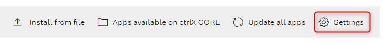
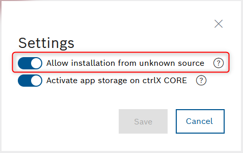
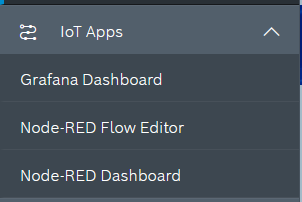
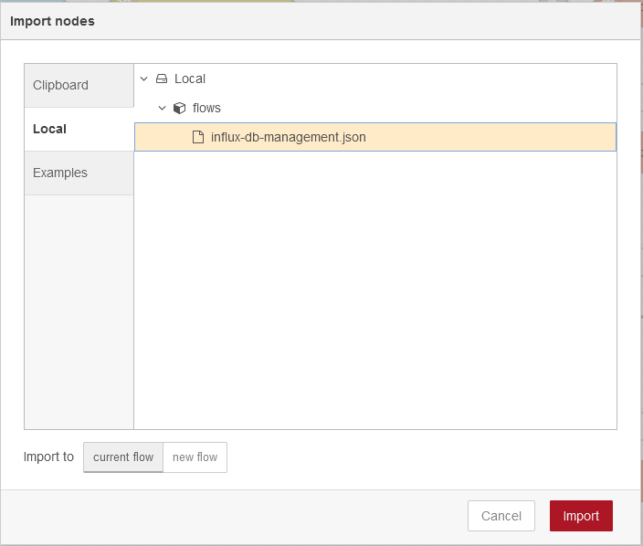

# Condition Monitoring App
This is a `Rexroth unofficial app` for the ctrlX Automation platform. If you are looking for `offical` apps from Rexroth, have a look at the [ctrlX Store](https://developer.community.boschrexroth.com/t5/Store-and-How-to/bg-p/dcdev_community-dev-blog/label-name/rex_c_Store).

This app is a bundle of [Node RED](https://nodered.org/), [InfluxDB](https://www.influxdata.com/) and [Grafana](https://grafana.com/). The main objective of this app is to give users a simpler and a faster way to create a condition monitoring solution.

Currently in version `1.3.1`, we bundle the following software versions:

```yaml
- node-red  v3.0.2
- influxdb  v1.8.10
- grafana   v9.2.2
```

And these are the nodes pre-installed on `Node RED`:
```yaml
- node-red-dashboard 
- node-red-contrib-influxdb 
- node-red-contrib-ctrlx-automation
- node-red-contrib-modbus
- node-red-debugger
```

# Installation
Within the apps installation page. Go to settings.


As this app is not official for `Bosch Rexroth`, you need to allow installation from unknown sources.


After a successful installation, you will see an IoT Apps menu entry on the left side of your screen.


## NodeRED Admin User
As of `v1.3.0`, Admin authentication mecanism is enabled. The app ships with default `boschrexroth` as user and password, but it is required for the user to change it right after installing. Please, refer to the [NodeRED official documentation](https://nodered.org/docs/user-guide/runtime/securing-node-red#usernamepassword-based-authentication) on how to set up your own user and password.

## Influx Authentication
As of `v1.3.0`, InfluxDB HTTP authentication mecanism is enabled. This means that, right after installing the app, it is required to create an admin user to manage your database instance. Refer to [Influx official documentation](https://docs.influxdata.com/influxdb/v1.8/administration/authentication_and_authorization/#user-management-commands) on how to manage users.

### Using NodeRED Dashboard
Terminal access trough SSH is disabled by default on ctrlX Core. So because of that, you'll need to use the `exec` node from `Node RED`. I've already set the path so you don't have to. Import the [influx-db-management.json](https://raw.githubusercontent.com/lg-lima1/condition-monitoring-app/master/config/influx-db-management.json) from the local storage in your Node-RED flow editor, deploy and use Node RED Dashboard on path `<ctrlx_ip_address>/node-red/ui/`.



### Error while trying to use the InfluxDB
If you try to insert a value to a database before configuring users, or, if you do not set the admin user correctly, the following error will pop up. Keep in mind that after creating the admin user, you need to update the influx node credentials inside Node RED.
```
ERR: error authorizing query: create admin user first or disable authentication
Warning: It is possible this error is due to not setting a database.Please set a database with the command "use <database>".
```
